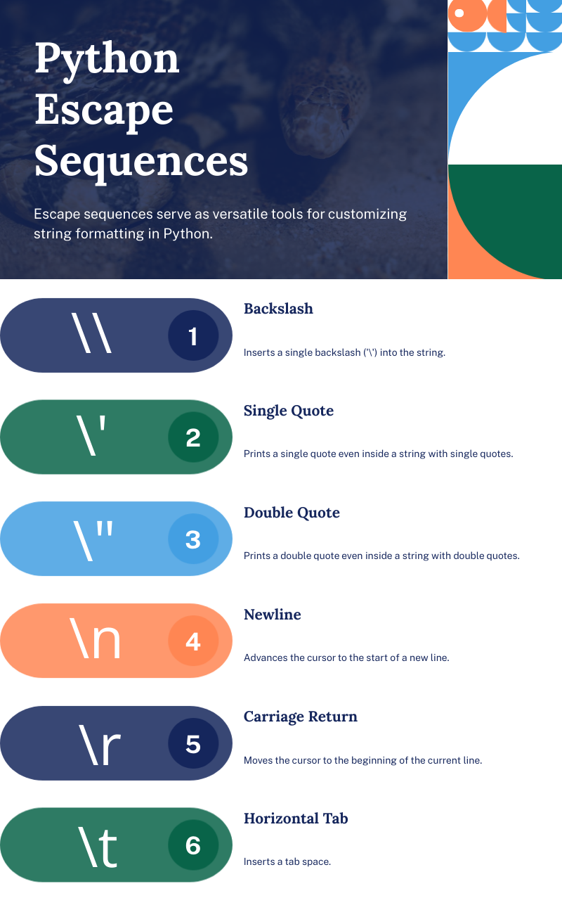

# Intro - Data Types, Variables, Printing and Input

Hey everyone! Welcome to the start of the AprilMayCodes Python tutorial series.
In this lesson, we'll cover some fundamental concepts in Python:
 - printing to the console
 - data types
 - variables
 - user input

By the end, you'll have a solid understanding of the basics and be ready to build your first project - a pokedex! Let's dive in.

## 1. Printing To The Console

Printing to the console is essential for displaying information to the user. It's great for command line projects, like the one we'll build at the end of the tutorial, and even more useful for debugging - seeing what's going on in your code.

To print something, we use the ```print()``` function. For example, to print 'Hello World!' we'd write:
```
print("Hello World!")
```

If you run this code, your output will be
```
Hello World!
```

"Hello World!" is a string.

You can use single quotes or double quotes for strings, but be consistent.

- 'Hello World" would return an error. The starting and ending character must match.

---
---
We can do even more with strings. For example, adding a new line with \n or concatenating (adding) strings together. Here's an example:
```
print('Hello ' + 'Viewer!\nYou\'re reading AprilMayCodes Intro Tutorial!')
```

Notice the space in 'Hello ' to ensure proper spacing in the output. Another thing you'll notice is the '\\' in 'you're'. This is because I printed the string with single quotations, so the program would expect that the string ends after the apostrophe. In order to prevent this, we add the backslash, which is an escape character. It basically tells Python that the following character needs to be interpreted differently than it normally would be.

In the case of 'You\'re' it tells Python that the apostrophe is not closing the string, but is instead a part of it.

In the case of \n it tells Python that we want to interpret the n as a new line, instead of a regular character. There are several other special escape sequences in Python. I've listed some below.



Note, if you need to include a backslash in your string, you would simply ‘escape’ the escape character, or put another backslash in front of it. This tells Python that the following character, the backslash, is to be interpreted as a part of the string, instead of as an escape character.

The output of the above code would be:
```
Hello Viewer!
You're reading AprilMayCodes Intro Tutorial!
```

---
Strings have additional methods, like `.capitalize()`, `.lower()`, and `.upper()`, which all do pretty much what you'd expect. Capitalize the first letter, make it all lowercase, or make it all uppercase. You can read more on string methods [here](https://www.w3schools.com/python/python_ref_string.asp).

A sidenote: In this tutorial series (and the corresponding videos, once I get those going), you'll see me type things after a `#` symbol. These are called comments, and are ignored by Python when you run your program, making them especially useful for tutorials, so I can label and, well, comment on what I'm typing.

But aside from their usefulness in tutorials, comments actually serve a real purpose. They help you and others who read your code understand what each part of the code does. This is especially helpful for complex sections of code or when you return to a project after some time and need a quick refresher on what your logic was. Comments can also be used to temporarily disable code when debugging or testing.

I've seen conflicting opinions on how frequently you should use comments in your code, but, especially if you're just starting out, I say *comment early, comment often*. It really helps keep your code easy to understand.

## 2. Taking User Input
Now, let's take user input using the `input()` function. This function displays a prompt and waits for the user to type something. Here's an example:
```
input("What is your favorite pokemon?")
```
When you run this code, it looks a lot like we had just called a print statement. The difference is that the cursor stays at the end of the line, it is waiting on a response from the user.

We can combine the `print()` and `input()` functions, for example, let's print the users response to the above question, with a question mark after, and then 'Good Choice!' I'll demonstrate how, and then break it down.

```
print(input('What is your favorite pokemon?') + '? Good choice!')
```
So this may look a bit complex (and in truth is not best practice, but more on that later) but let's break it down.

`input("What is your favorite pokemon?")` is essentially storing the users response. So the print statement doesn't print "input blah blah" (notice `input()` is not in a string). Instead, it replaces that with whatever the users input was.

Then the rest of the line '? Good choice!' just adds this to the end of the user input (remember you can add strings together with `+`)
So if I ran the code, the output would look something like this
```
What is your favorite pokemon?
```
I'd respond with Gengar and hit enter, and see the following:

```
What is your favorite pokemon?Gengar
Gengar? Good choice!
```

So, that's great. But also very sloppy and easy to mix up. Let's move on to saving values to variables.

## 3. Variables
Variables are used to store data that we can use and manipulate throughout our code. You can assign a value to a variable using the **assignment operater**, which is a single equals sign.
```
num = 37
print(num)
```
Output:
```
37
```
Passing the variable name to the print statement prints what is stored in that variable, rather than just the variable name (again, notice `num` above is not a string).

Now, if we update our code to the following:
```
num = 37
print(num)
num = "a number"
print(num)
```
The output would be:
```
37
a number
```

The printed value has changed. When Python gets to the first print statement, the value of `num` is the integer 37. But then it runs the next lines of code, replacing the value of `num` with the string "a number". When it gets to the second print statement, the value of `num` is updated, so it returns the new value.

It's this simple to update a variables value; just reassign it.

---
Connecting this back to our earlier issuee.
Instead of
```
print(input('What is your favorite pokemon?') + '? Good choice!')
```
We can save the users response in a variable, and print that.
Let's rewrite this to save the input to a variable called `fav_pokemon`.
```
fav_pokemon = input("What is your favorite pokemon?")
print(fav_pokemon + '? Good choice!')
```
The output for this would be the same as above. It would first ask for the input, then save that to the `fav_pokemon` variable, then print our completed statement.

---
Naming conventions are important for readability. The first thing to remember is that you want your code to be readable. Nothing worse than coming back to a project after a break and not understanding what does what. While it may save time to use names like `n` for number, you want to know what that variable represents, so it’s better to use something more clear like `num`.

In Python, best practice for naming variables is using snake_case, which means using lowercase letters and underscores to separate words. So you would do something like this
`snake_case` instead of this `camelCase` which is commonly used in javascript.

And finally, avoid using reserved terms or starting variable names with numbers. While it may not break your code initially, using reserved terms as variable names can confuse Python, as it expects that reserved term to be something else. For more information about reserved terms, check out [this article](https://medium.com/@digidim3/the-35-reserved-keywords-of-python-52482fad716d#:~:text=Some%20of%20the%20most%20common,was%20added%20to%20the%20language.)

So, we've discussed strings. Let's explore some additional data types.

## 4. Data Types
Python supports various data types, including strings, integers, floats, lists, booleans, and dictionaries. Let's go over each one.

### Strings
A string is a chain of characters within quotes. 
```
pokemon = “Pikachu”
print(pokemon)
```
Output
```
Pikachu
```

### Integers
Integers are whole numbers without decimals. Note that `“17”` is a string while `17` is an integer (or int). Integers are stored in variables similar to strings, but without any containing characters.

Continuing with our pokemon example, we could say something like 
```
attack = 55
print(attack)
```
Output
```
55
```

### Floats
Floats are numbers with decimals. If, for some reason, we wanted to be able to update our health more specifically, using decimals rather than just whole numbers, we could say
```
health = 35.0
print(health)
```
Output
```
35.0
```
### Lists
Lists are a collection of items. You create a list using square brackets [ ]. Lists can contain any type of data, and are very useful for storing like pieces of information.
```
abilities = ['Static', 'Lightning Rod']
```
To access items in a list, we can use the items index. In programming, indexes typically start with 0, rather than 1. So to get the first item in a list we would do:
```
print(abilities[0])  # Accessing the first item
```
Output
```
Static
```
To get the second item we would do
```
print(abilities[1]) 
```
and so on.

Note, the above list contains only strings, but lists can contain any type of data including integers and floats, variables, other lists, and booleans and dictionaries (more on those below).

### Booleans
Booleans, or Bool values, are True or False values.
```
evolved = True
```
Note the capitalization for bool values
```
print(evolved)
```
Output
```
True
```

### Dictionaries
Dictionariess store key-value pairs. These are created with curly brackets {}. Each key can contain any type of data as its *value*, strings, ints, lists, even other dictionaries, or `None`, which is another data type representing the absence of a value. We’ll get to that more in a future lesson.
```
pikachu = {
    'name': 'Pikachu',
    'type': 'Electric',
    'hp': 35,
    'attack': 55,
    'abilities': ['Static', 'Lightning Rod'],
    'evolution': True
    }
```
To access a dictionary value, you use bracket notation with the key instead of the index.
```
print(pikachu['name'])
```
You can also use `.get()`
```
print(pikachu.get("name"))
```
The output for both of the above statements would be
```
Pikachu
```

Note, regardless of how you create your dictionary key (single quotes or double quotes), you can always access it using either.

---

Dictionaries can also contain other dictionaries. For example, let’s create a pokedex dictionary, that contains our pikachu dictionary.
```
pokedex = {
  ‘pikachu’: pikachu
  }
```
This could also be written as:
```
pokedex = {
    'pikachu': {
        'name': 'Pikachu',
        'type': 'Electric',
        'hp': 35,
        'attack': 55,
        'abilities': ['Static', 'Lightning Rod'],
        'evolved': False
    }
}
```
If we wanted to add another key-value pair to our dictionary, similar to a list, we'd just add a comma after the last value and add the new key-value pair.
```
pokedex = {
    'pikachu': pikachu,
    'gengar': 'gengar'
}
```
For nested dictionaries (dictionaries within dictionaries), the process to access values is the same. For example, to access pikachu’s name now we would do
```
print(pokedex[‘pikachu’][‘name’])
```
The `pokedex['pikachu']` is equal to our pikachu dictionary, which is stored in the pikachu variable.
Then we use bracket notation again on *THAT* to access the name key, which returns the value 'pikachu'.

There are additional ways to access dictionary information, like the using `.keys()`, `.values()` and `.items()`, depending on what information you need to access. We'll go into that more in a future tutorial.
 
 ---

You can't concatenate different data types directly. For example, if I wanted to print pikachu has 35 health, I couldnt do
```
print(“Pikachu has “ + pokedex['pikachu'][‘hp’] + “ HP.”)
```
This returns a TypeError (more on errors in a future video). Your output will include something like the following:

```
TypeError: can only concatenate str (not "int") to str
```
Because we can't concatenate the different types, we can convert them to a common type using functions like `str()`, `int()`, or `float()`.

## 5. Type Conversion

Converting data types is essential when working with different kinds of data. So let’s take a look at how it's done.

You can use the `str()`, `int()`, and `float()` methods for conversions.
```
print(“Pikachu has “ + str(pikachu[‘hp’]) + “ HP.”)
```
In this line, we use str() to convert the hp value to a string before concatenating it to our statement.

When we want to convert a float to an int, it's important to remember it doesnt round it up or down like we may expect.
Instead, it simply drops the decimal, returning only the whole number.

When adding floats and ints, we don't need to convert them, python does this for us automatically because they're both Numeric Types. It will convert the int to a float, and always return a float type, even if it is a whole number.

Let's look at some examples. 

For the following code, think about what you expect the output to be.
```
print(3 + 3.0)
print(3 + int(3.0))
print(3 + 2.9)
print(int(3 + 2.9))
```

---
---
Output:
```
6.0     # Adding int + float = float
6       # adding int + int = int
5.9     # adding int plus float = float
5       # converting float to int drops the decimal, regardless of rounding
```

If you're unsure of a variables type, you can use the `type()` function.

For example:
```
example_one = 3 + 4
print(type(example_one))

example_two = 3 + 4.0
print(type(example_two))
```
Output
```
<class 'int'>
<class 'float'>
```

The first example, addition between two integers, is an integer.
The second example, addition between an int and a float, is a float.

F-strings make mixing strings and variables easy.

## 6. F-Strings

Instead of converting variables and using concatenation over and over, you can use f-strings for cleaner code. This is done by putting f *before* the quotation marks, and putting the variables you’re referencing within curly brackets `{}` in the string.

Let’s change our example above to use an f string.
```
print(f“Pikachu has {pokedex['pikachu'][‘hp’]} HP.”)
```
Notice we use double quotes for the string, and single quotes in the bracket notation.
This works the same in reverse.
```
print(f'Pikachu has {pokedex["pikachu"]["hp"]} HP.')
```
Always alternate when using quotes within quotes to avoid errors.
Output
```
Pikachu has 35 HP.
```
We can also print out our dictionary data on new lines, to keep it readable. For example:

```
print(f'Pikachu has {pokedex["pikachu"]["hp"]} HP.\n Pikachu’s attack power is {pokedex["pikachu"]["attack"]}')
```
Output
```
Pikachu has 35 HP.
Pikachu's attack power is 55
```

Let’s wrap up by doing a project - creating a Pokedex.

## 7. Project - Pokedex

To create our command line pokedex, I’ve created dictionaries for different pokemon and stored them in another dictionary called `pokedex`. You can copy the starter code below, or create your own dictionaries.

We’re going to use user input to display information about a selected Pokémon.

```
pikachu = {
    'name': 'Pikachu',
    'type': 'Electric',
    'hp': 35,
    'evolution': False
    }

gengar = {
    'name': 'Gengar',
    'type': 'Ghost/Poison',
    'hp': 60,
    'evolution': True
    }

paras = {
    'name': 'Paras',
    'type': 'Bug/Grass',
    'hp': 35,
    'evolution': False
    }

pokedex = {‘pikachu’: pikachu, ‘gengar’: gengar, ‘paras’; paras}
```

Note, you can put dictionaries all on one line, as above, but it is typically more readable to use multiple lines.

---

Now, we want to ask the user which pokemon they want to learn about. Let’s ask the user, and include in the prompt our pokemon options, so they know which inputs are valid.

Before scrolling, see if you can create an input that stores the users pokemon choice, lowercase, in a variable called "choice".

<details>
<summary>Did you figure it out? Let’s work through it together.</summary>
We want a variable called choice, so we’ll start with that

```
choice =
```

And we want that to be set to whatever the user responds with. So we’ll set it equal to an input with the prompt (“which Pokemon would you like to learn about? Pikachu, gengar, or paras?")

```
choice = input("Which pokemon would you like to learn about? Pikachu, gengar, or paras?")
```

Finally, we’ll call `.lower()` to set it to lowercase, so we can use this choice as our dictionary key.

We can do this by updating choice to be equal to choice.lower()
```
choice = choice.lower()
```
Another method is to simply call `.lower()` on the input.
```
choice = input('Which pokemon would you like to learn about? Pikachu, gengar, or paras?’).lower()
```
</details>

---

Now, can you figure out how to print the requested information? Take some time and see if you can print each detail out on a new line, like this

Desired output example:
```
Name: Pikachu
Type: Electric
HP: 35
Evolution: False
```
<details><summary>How’d you do? Let’s work through it together.</summary>

We want to print each item on a new line. So we’ll start by calling print, and use an f string to make incorporating all the different data types easier.

```
print(f“Name: {pokedex[choice][‘name’]}\nType: {pokedex[choice]['type']}\nHP: {pokedex[choice]['hp']}\nEvolution: {pokedex[choice]['evolution']}")
```
</details>

---

Now, let’s make it a bit more complex. What if we only want to return specific information? Can you figure out how to ask the user which information they want returned, and print something like "The requested information is: {requested information}"?

<details>
<summary>Let's go over it.</summary>
After asking for the `choice`, lets create another variable, `req_info`, that asks what the user would like to know (and lists the options)

```
req_info = input('What info would you like to know? Name, type, hp, or evolution? ').lower()
```

We set this to lower as well, so we can pass it in as our dictionary key.

Now we’ll print the requested information.
```
print(f”The information you requested is: {pokedex[choice][req_info]}”)
```

All in all it should look something like this:
```
Which pokemon would you like to learn about? Pikachu, gengar, or paras? Gengar
What info would you like to know? Name, type, hp, or evolution? Evolution
The information you requested is: True
```
</details>

---

#### So, how'd you do?

Well, that's it! We've covered printing to the console, data types and variables, getting user input, and even created a Pokedex project.

I hope this was a useful introduction to Python and the brilliant things you can do with it. Stay tuned, there’s so much to learn!

# Happy Coding!
